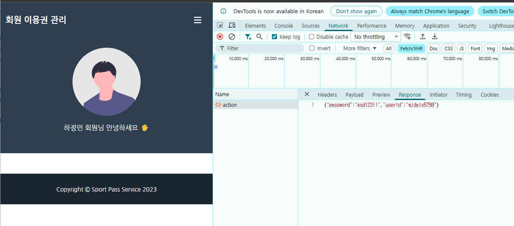

# Sport 예약 메이트 — SW 테스트 포트폴리오

스포츠 수업 이용권 등록·예약 웹 서비스(Spring Boot + Spring Batch)를 **테스터 관점에서 분석하고 개선한 프로젝트**입니다.
부하 테스트로 배치 병목을 찾아 코드를 개선하고, 탐색적 테스트로 보안·사용성 결함을 발견해 수정했으며, 발견한 결함은 자동화 회귀 테스트로 고정했습니다.

## 핵심 성과

| 영역               | 결과                                                                                                                |
| ------------------ | ------------------------------------------------------------------------------------------------------------------- |
| **배치 성능 개선** | 이용권 1만 건 전개를 **11.39초**에 처리 (개선 전 400건도 300초 안에 끝나지 않음). 같은 건수 기준 **105~356배** 단축 |
| **결함 발견·수정** | 로그인 응답의 **비밀번호 원문 노출**(DEF-001), 관리자 대시보드 400 오류(ET2) 등 수정 후 회귀 테스트로 고정          |
| **자동화 테스트**  | Selenium + pytest + PyMySQL + requests로 **화면 → 응답 → DB**까지 검증하는 테스트 구축                              |
| **테스트 케이스**  | 64건 설계 (수행 38건, 향후 계획 26건)                                                                               |

## 목차

1. [프로젝트 구성](#1-프로젝트-구성)
2. [Spring Batch 성능 개선](#2-spring-batch-성능-개선)
3. [부하 테스트 (k6)](#3-부하-테스트-k6)
4. [탐색적 테스트와 결함 수정](#4-탐색적-테스트와-결함-수정)
5. [자동화 테스트](#5-자동화-테스트)
6. [한계와 향후 과제](#6-한계와-향후-과제)
7. [배운 점](#7-배운-점)

---

## 1. 프로젝트 구성

```
SW-Test-Refactoring/
├── pass-project-master/     # 웹 서버 (8080) - Spring Boot 2.6.8, JPA, Spring Security
├── pass-batch-master/       # 배치 서버 (8081) - Spring Batch 4.3.6
├── pass-selenium-test/      # 테스트 코드
│   ├── JS/                  # k6 부하 테스트 스크립트
│   ├── pages/               # Selenium Page Object
│   └── tests/               # pytest 테스트
├── images/                  # 결함 증거 캡처
└── docs/                    # 테스트 수행 보고서, 테스트 케이스
```

| 항목 | 내용                                                                 |
| ---- | -------------------------------------------------------------------- |
| 대상 | 웹(8080) + 배치(8081) + MySQL 8.0 (같은 DB 공유)                     |
| 도구 | k6, Python 3.12, Selenium 4, pytest, PyMySQL, requests               |
| 환경 | Windows 11, i7-10700, RAM 32GB (부하 생성기와 서버를 한 PC에서 실행) |

---

## 2. Spring Batch 성능 개선

관리자가 등록한 이용권(bulk_pass)을 `addPassesJob` 한 번으로 회원별 이용권(pass)과 예약 슬롯(booking)으로 전개하는 배치입니다. **1만 건 처리 요구사항**을 기준으로 건수를 늘려 가며 처리 시간을 측정했습니다.

### 문제 발견

| 건수 | 소요 시간                      | 건당    |
| ---- | ------------------------------ | ------- |
| 100  | 17.01초                        | 170.1ms |
| 200  | 99초                           | 495.0ms |
| 400  | 300초 안에 응답 없음 (timeout) | -       |

건수가 2배가 되자 시간이 **5.8배** 늘었습니다. 처리량에 비례하지 않고 훨씬 빠르게 느려지는 패턴이라 반복 구조에 원인이 있다고 보고 코드를 분석했습니다.

### 원인: 건마다 2k+2회의 반복 조회

`AddPassesTasklet.addBooking()`이 반복문의 **조건과 본문에서 매번** `findByUserId()`를 다시 호출하고, 결국 마지막 값 하나만 사용했습니다.

```java
for (int i = 0; i < passRepository.findByUserId(userId).size(); i++) {          // 조건마다 조회
    booking.setPassSeq(passRepository.findByUserId(userId).get(i).getPassSeq());  // 본문마다 조회
}
```

| 위치                            | 실행 횟수 (k = 해당 사용자의 이용권 수) |
| ------------------------------- | --------------------------------------- |
| findByUserGroupId (결과 미사용) | 1                                       |
| for 조건의 findByUserId         | k + 1                                   |
| 본문의 findByUserId             | k                                       |
| **합계**                        | **2k + 2**                              |

이용권이 저장될수록 k가 늘어나므로, 같은 사용자 N건을 처리하면 조회 횟수가 대략 N²에 비례합니다.

### 개선: 저장한 엔티티를 그대로 전달

```diff
 for (BulkPassEntity bulkPassEntity : bulkPassEntities) {
-    final List<String> userIds = userGroupMappingRepository
-            .findByUserGroupId(bulkPassEntity.getUserGroupId())   // 결과 미사용
-            .stream().map(UserGroupMappingEntity::getUserId).collect(Collectors.toList());
-    count  += addPasses(bulkPassEntity, bulkPassEntity.getUserId());
-    count2 += addBooking(bulkPassEntity.getUserId());             // userId로 다시 조회
+    PassEntity savedPass = addPass(bulkPassEntity, bulkPassEntity.getUserId());
+    count++;
+    count2 += addBooking(savedPass);                              // 저장한 엔티티 전달 (조회 0회)
     bulkPassEntity.setStatus(BulkPassStatus.COMPLETED);
 }
```

- `addPasses()`가 개수만 반환하던 것을, 저장된 `PassEntity`를 반환하는 `addPass()`로 변경
- `addBooking()`은 전달받은 엔티티의 `passSeq`를 바로 사용해 **건당 SELECT 0회**
- 결과를 쓰지 않던 `findByUserGroupId()` 제거

전체 코드: [`AddPassesTasklet.java`](pass-batch-master/pass-batch-master/src/main/java/com/yeom/pass/job/pass/AddPassesTasklet.java)

### 개선 결과

| 건수   | 개선 전           | 개선 후                 | 개선 배수  |
| ------ | ----------------- | ----------------------- | ---------- |
| 100    | 17.01초           | 161.48ms (1.61ms/건)    | 약 105배   |
| 200    | 99초              | 278.15ms (1.39ms/건)    | 약 356배   |
| 400    | 300초 안에 미완료 | 467.71ms (1.17ms/건)    | 최소 641배 |
| 10,000 | 미측정            | **11.39초 (1.14ms/건)** | -          |

- 건수가 25배(400 → 10,000)일 때 시간은 24.4배로, **건수에 비례(선형)**하는 형태로 바뀜
- 개선 전후 동작이 같은지 SQL로 확인: bulk_pass N건 COMPLETED, pass·booking 각 N건, booking의 고유 `pass_seq` N개

> 테스트 데이터가 한 사용자에게 몰려 있어 이 약점이 극단적으로 드러났습니다. 사용자가 분산된 데이터에서의 측정은 향후 과제입니다.

---

## 3. 부하 테스트 (k6)

### 이용권 대량 등록 — 측정 대상 바로잡기

VU 20명이 `POST /admin/bulk-pass`를 1만 회 호출했는데, 1차 실행은 10분 동안 **7,243건만 완료**됐습니다.

- **원인**: k6가 302 리다이렉트를 자동으로 따라가, 등록할 때마다 **페이징 없는 전체 목록 화면**까지 조회·렌더링
- **조치**: `redirects: 0`으로 등록 요청만 측정하고 302 응답만 성공으로 판정
- **결과**: 10,000/10,000건 완료(1분 9.4초), 실패율 0%, DB 유실 없음

VU를 20으로 정한 이유는 HikariCP 커넥션 풀 기본 크기(10)를 넘겨, 커넥션을 기다리는 요청이 생기는 상황을 만들기 위해서입니다.

### 로그인 페이지 동시 접속

| VU     | 100     | 200     | 500     | 1,000   | 5,000  | 10,000 |
| ------ | ------- | ------- | ------- | ------- | ------ | ------ |
| avg    | 12.31ms | 19.65ms | 36.65ms | 59.87ms | 1.44s  | 2.76s  |
| 실패율 | 0.00%   | 4.45%   | 7.12%   | 7.95%   | 16.28% | 47.84% |

> 한 PC에서 1만 VU를 생성했기 때문에, 실패의 일부는 부하 생성기 쪽 자원 부족일 수 있습니다.

스크립트: [`pass-selenium-test/JS/`](pass-selenium-test/JS/)

---

## 4. 탐색적 테스트와 결함 수정

### DEF-001: 로그인 응답에 비밀번호 원문 노출

DB에는 BCrypt 해시로 저장하지만, 로그인 응답 본문과 브라우저 Console에 **비밀번호 원문**이 그대로 출력됐습니다.



- `LoginController`: 아이디·비밀번호를 담던 응답을 빈 JSON(`{}`)으로 변경
- `login.mustache`: `console.log(data)`, `console.log(result)` 제거
- 자동화 회귀 테스트 `test_login_response_has_no_password`로 고정

### ET2: 관리자 대시보드 400 Bad Request

`/admin`에 파라미터 없이 접속하면 400이 발생했습니다. `@RequestParam("to")`가 필수였기 때문입니다.

```diff
-public ModelAndView home(ModelAndView modelAndView, @RequestParam("to") String toString) {
-    LocalDateTime to = LocalDateTimeUtils.parseDate(toString);
+public ModelAndView home(ModelAndView modelAndView,
+                         @RequestParam(value = "to", required = false) String toString) {
+    LocalDateTime to = (toString == null) ? LocalDateTime.now() : LocalDateTimeUtils.parseDate(toString);
```

### 결함 목록

| ID       | 내용                                                      | 상태                        |
| -------- | --------------------------------------------------------- | --------------------------- |
| DEF-001  | 로그인 응답·Console에 비밀번호 원문 노출                  | 수정 완료, 회귀 테스트 고정 |
| ET2      | `/admin` 파라미터 없이 접속 시 400                        | 수정 완료                   |
| PERF-001 | 배치 반복 조회 병목 (건당 SELECT 2k+2회)                  | 수정 완료                   |
| -        | 관리자 로그인 실패 시 alert 미표시                        | 수정 완료                   |
| DEF-004  | 가입 처리 중 예외를 삼켜 **저장 없이 200 응답**           | 확인 (미수정)               |
| PERF-002 | 이용권 일괄 등록 목록에 페이징 없음                       | 확인 (미수정)               |
| DEF-002  | `== ""` 비교로 빈 이름·이메일 검사가 동작하지 않을 가능성 | 후보 (코드 분석)            |
| DEF-003  | BCrypt 72바이트 초과 비밀번호 뒷부분 무시 가능성          | 후보                        |

> ET1은 이후 DEF-001로 등록했습니다.

---

## 5. 자동화 테스트

로그인·회원가입을 Selenium으로 조작하고, **화면에서 한 행동이 DB에 제대로 반영됐는지** PyMySQL로 확인합니다. 화면을 거치지 않는 API 테스트로 응답 본문까지 검사합니다.

### 설계 포인트

| 기법                 | 적용                                                                     |
| -------------------- | ------------------------------------------------------------------------ |
| Page Object          | `LoginPage`, `JoinPage`에 선택자와 동작을 모아 화면 변경 시 한 곳만 수정 |
| 명시적 대기          | `time.sleep` 대신 `WebDriverWait` + `alert_is_present` / `url_contains`  |
| fixture `yield` 정리 | 테스트가 실패해도 브라우저 종료와 테스트 계정 삭제가 실행됨              |
| 자체 데이터 생성     | uuid로 매번 새 계정을 만들고 지워 DB 상태에 의존하지 않음                |
| DB 검증              | 가입 후 행 수와 BCrypt 해시 형식까지 확인                                |
| 결함 관리            | 원인이 확인된 결함만 `xfail(strict=True)`로 기록, 수정되면 FAILED로 알림 |
| 비밀 정보            | DB 비밀번호는 환경변수(`DB_PASSWORD`)로 전달                             |

### 테스트 목록

| 파일                     | 검증 내용                                                                   | 결과         |
| ------------------------ | --------------------------------------------------------------------------- | ------------ |
| `test_login_practice.py` | 틀린 비밀번호·없는 ID alert, 비밀번호 BCrypt 저장, 화면 가입 후 DB 저장     | 4건 통과     |
| `test_api_1.py`          | 로그인 200, **응답에 비밀번호 원문 없음 (DEF-001 회귀)**, 틀린 비밀번호 400 | 3건 통과     |
| `test_api_2.py`          | 가입 API 응답과 DB 저장 관찰                                                | DEF-004 발견 |
| `test_xfail_demo.py`     | xfail 운영 방식 예제                                                        | XFAIL        |

### 실행 방법

```powershell
cd pass-selenium-test
pip install selenium pytest pymysql requests
$env:DB_PASSWORD="DB 비밀번호"
python -m pytest -v                         # 전체
python -m pytest -v tests/test_api_1.py     # 파일 하나
```

웹 서버(8080)가 실행 중이어야 하며, `pytest.ini`의 `pythonpath = .` 설정으로 `pages` 패키지를 불러옵니다.

### 응답만 보지 않고 DB까지 확인한 사례

가입 API는 정상 값과 이름 공란 모두 `200 {}`를 반환했지만, DB를 확인하자 **정상 값도 저장되지 않았습니다.** 정상 요청(대조군)을 먼저 확인한 덕분에 "빈 이름이 서버에서 걸러졌다"는 잘못된 해석을 철회하고 원인을 찾았습니다.

1. 화면은 jQuery `serialize()`로 **폼 형식** 전송, 컨트롤러에 `@RequestBody`가 없어 JSON 본문은 무시됨
2. 모든 필드가 null → BCrypt 암호화 중 예외
3. `catch`가 `printStackTrace()`만 하고 정상 흐름으로 복귀 → **저장 없이 200 응답 (DEF-004)**

---

## 6. 한계와 향후 과제

**한계**

- 부하 생성기와 서버, DB를 한 PC에서 실행해 측정값에 자원 경합이 포함됨
- 배치 테스트 데이터가 한 사용자에게 몰려 있음
- 테스트 케이스 64건 중 26건은 설계만 완료

**향후 과제**

- DEF-002·003 실행 확인, 가입 API를 폼 형식으로 수정해 경계값 테스트 수행
- 예약 시간 중복 차단(네거티브), 통계 그래프와 DB 값 정합성 확인
- 이용권 차감·시간표 변경·회원 등록의 동시 처리 검증

---

## 7. 배운 점

- **측정 대상을 정확히 한정해야 한다** — k6가 302를 따라가며 목록 조회까지 측정하던 문제를 바로잡았습니다.
- **건수를 바꿔 가며 증가 패턴을 봐야 병목이 보인다** — "느리다"가 아니라 "2배에 5.8배"라는 패턴에서 반복 조회 구조를 찾았습니다.
- **응답만 보지 말고 DB까지 확인한다** — 200 응답 뒤에 숨은 저장 실패를 DB 검증으로 발견했습니다.
- **대조군으로 해석을 검증한다** — 정상 요청을 먼저 확인해 잘못된 결론을 결함으로 기록하는 일을 막았습니다.
- **결함은 회귀 테스트로 남긴다** — DEF-001을 테스트로 고정해 재발하면 자동으로 잡히게 했습니다.

## 문서

- [테스트 수행 보고서 (docx)](main/Sport예약메이트_테스트보고서.docx)
- [테스트 케이스 (xlsx)](main/Sport예약메이트_테스트케이스.xlsx)
